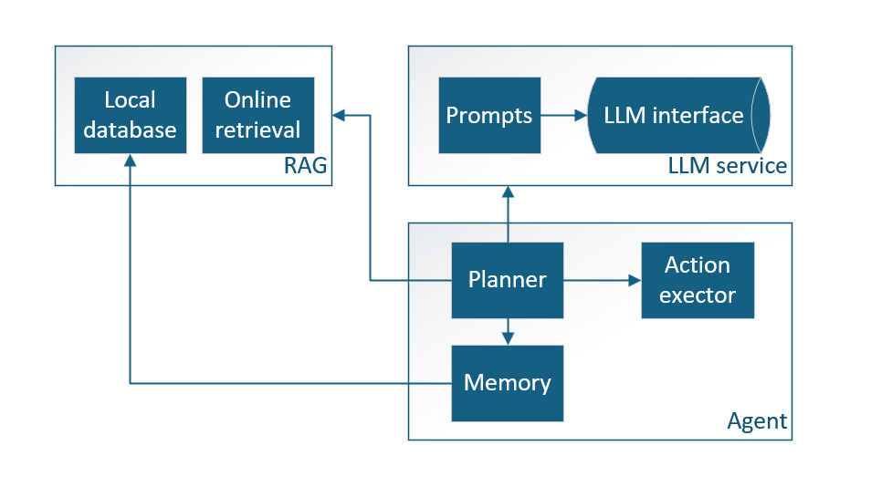
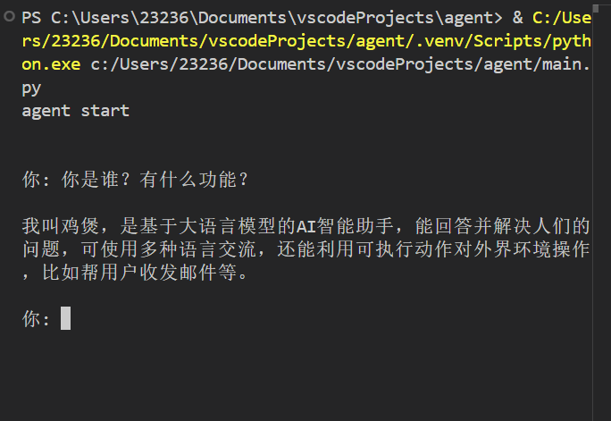
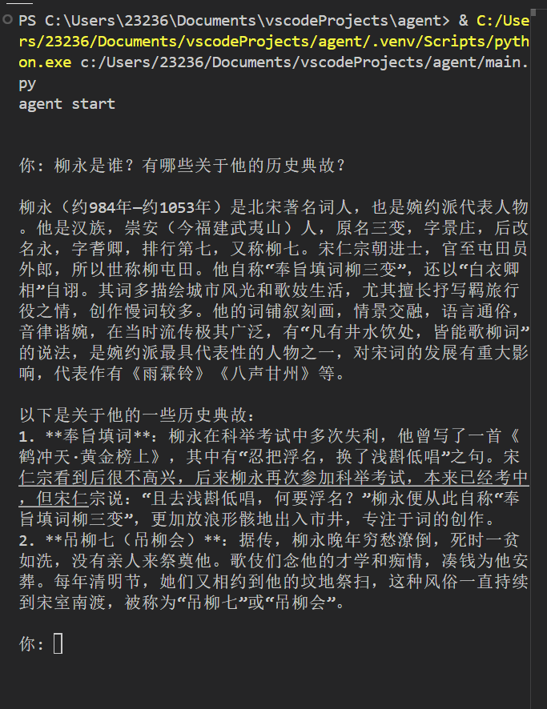

# 简介
用python编写的简单agent框架。
基于大语言模型的智能助理。



# 功能
- 基于本地知识库的信息查询和整理(联网查询功能待完成)
- 智能对话
- 自定义工具扩展

# 项目结构
```
agent
├─ main.py # 程序入口
├─ README.md
├─ requirements.txt 
├─ src
│  ├─ agent # agent基类和核心模块
│  │  ├─ action.py # 行为执行模块
│  │  ├─ agent.py # agent基类
│  │  ├─ memory.py # 记忆模块，保存短期记忆
│  │  ├─ plan.py # 规划模块，划分子任务
│  │  └─ __init__.py
│  ├─ config
│  │  ├─ settings.py # 参数设置
│  │  └─ __init__.py
│  ├─ llm # 提供大模型调用服务
│  │  ├─ base.py 
│  │  └─ __init__.py
│  ├─ prompts 
│  │  ├─ builder.py # 构造prompts
│  │  ├─ chain_of_thought.py # 思维链模板
│  │  ├─ identity.py # agent身份描述
│  │  ├─ personalities # agent人设
│  │  │  ├─ assistant.py
│  │  │  └─ __init__.py
│  │  ├─ rag.py # RAG相关prompts
│  │  ├─ response.py
│  │  └─ __init__.py
│  ├─ rag # RAG模块
│  │  ├─ documents.py # 文件基类
│  │  ├─ embedding.py # 文本嵌入(文本转向量)
│  │  ├─ kdb # 知识库
│  │  │  ├─ 刘过.md
│  │  │  ├─ 李白.md
│  │  │  └─ 柳永.md
│  │  ├─ rag_client.py # 提供RAG服务
│  │  ├─ storage # 本地知识库
│  │  │  ├─ documents.txt 
│  │  │  ├─ vectors.npy # 知识库的向量存储
│  │  │  └─ vector_ids.txt
│  │  ├─ vectorstore.py # 向量知识库的保存和读取
│  │  └─ __init__.py
│  ├─ tools # 提供agent对外部操作的工具
│  │  ├─ base.py
│  │  ├─ chat_tools.py
│  │  ├─ registry.py
│  │  └─ __init__.py
│  ├─ ui 
│  │  └─ __init__.py
│  └─ utils # 基础工具集
│     ├─ load_file.py
│     └─ __init__.py
├─ tests # 功能测试
│  ├─ action_test.py
│  ├─ llm_test.py
│  ├─ plan_test.py
│  └─ rag_test.py
└─ __init__.py

```
## llm模块
目前使用了字节的豆包，以及字节的embedding模型

## RAG模块
本地知识库：原始文档保存在kdb目录,向量化知识库保存在storage目录,目前可支持读取markdown,txt,pdf格式的文档插入本地知识库。

构建知识库的具体过程:读取原始文档 -> 文档切分 -> 文本向量化 -> 本地存储

知识库检索的过程：把查询关键词向量化，再与向量知识库的内容进行比较（计算余弦值），然后返回最接近的若干条记录。

# 功能演示
## 基本对话

## 知识检索



# TODO
- 实现UI模块
- 增加更多行为工具扩展
- 实现定时服务
- 实现联网搜索和知识库动态更新
- 增加更多可供调用的大模型（以及本地部署的模型）

# 相关项目
[agent_chat_wechat](https://github.com/panxingfeng/agent_chat_wechat): RAG部分的实现参考了该项目